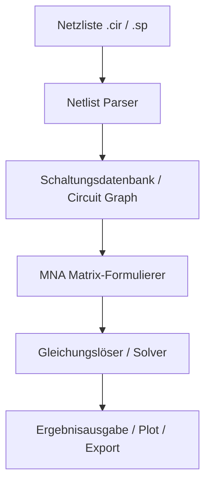

# Funktionsweise und Architektur eines SPICE-Simulators

Ein SPICE-Simulator (Simulation Program with Integrated Circuit Emphasis) dient der mathematischen Berechnung des Verhaltens elektrischer Schaltungen. Um einen solchen Simulator Schritt für Schritt in Free Pascal aufzubauen, müssen wir die mathematischen und softwaretechnischen Grundlagen verstehen.

Dieses Dokument beschreibt die Kernkomponenten, die mathematische Formulierung (Modified Nodal Analysis) und den Ablauf der verschiedenen Simulationstypen.

---

## 1. Kernkomponenten eines SPICE-Simulators

Ein SPICE-Simulator besteht im Wesentlichen aus fünf Hauptblöcken:

1. **Parser (Netzlisten-Reader):** Liest die Schaltungsbeschreibung (Netzliste) ein. Eine Netzliste beschreibt, welche Bauelemente (Widerstände, Kondensatoren, Transistoren usw.) mit welchen Knoten (Nodes) verbunden sind.
2. **Datenstruktur (Circuit Database):** Speichert die Bauelemente, ihre Parameter (Werte, Modelle) und die Topologie (Knotenverbindungen).
3. **Matrix-Formulierer (MNA-Engine):** Übersetzt die physikalischen Gesetze der Bauelemente (z. B. das Ohmsche Gesetz für Widerstände) in ein lineares oder nichtlineares Gleichungssystem unter Verwendung der **Modifizierten Knotenpotentialanalyse (MNA)**.
4. **Gleichungslöser (Solver):**
   - **Linear:** Löst $A \cdot x = b$ mittels LU-Zerlegung (später idealerweise als Sparse-Matrix-Solver).
   - **Nichtlinear (z. B. Dioden, Transistoren):** Verwendet das **Newton-Raphson-Verfahren** zur iterativen Linearisierung.
   - **Zeitdiskret (Transientenanalyse):** Nutzt numerische Integrationsverfahren (z. B. Trapezregel, Euler rückwärts), um die Differentialgleichungen von Kondensatoren und Spulen in algebraische Gleichungen zu überführen.
5. **Ausgabe-Einheit:** Bereitet die berechneten Knotenspannungen und Zweigströme für die Anzeige oder das Abspeichern vor.

---

## 2. Modifizierte Knotenpotentialanalyse (MNA)

Die MNA ist das mathematische Herzstück von SPICE. Sie basiert auf den Kirchhoffschen Regeln, insbesondere dem Knotensatz (KCL - Kirchhoff's Current Law): Die Summe aller Ströme in einem Knoten ist Null.

Das Gleichungssystem hat die Form:

$$A \cdot x = z$$

Dabei ist:
* **$A$ (MNA-Matrix):** Enthält die Leitwerte (Leitwert-Matrix $G$) und die Beziehungen für Spannungsquellen ($B$ und $C$).
* **$x$ (Lösungsvektor):** Enthält die unbekannten Knotenpotentiale (Spannungen der Knoten gegen Masse) und die unbekannten Ströme durch Spannungsquellen und Spulen.
* **$z$ (Rechte-Seite-Vektor / RHS):** Enthält die bekannten Strom- und Spannungsquellen.

### Struktur der MNA-Matrix $A$

Für eine Schaltung mit $N$ Knoten (ohne Bezugsknoten/Masse `0`) und $M$ spannungsdefinierten Bauelementen (Spannungsquellen, Spulen) hat die Matrix die Dimension $(N+M) \times (N+M)$:

$$\begin{pmatrix} G & B \\ C & D \end{pmatrix} \begin{pmatrix} v \\ i \end{pmatrix} = \begin{pmatrix} j \\ e \end{pmatrix}$$

* **$G$ ($N \times N$):** Leitwertmatrix. Nur aus Widerständen gebildet.
* **$B$ ($N \times M$):** Beschreibt, wie die Ströme der Spannungsquellen in die Knoten fließen.
* **$C$ ($M \times N$):** Beschreibt die Knotenspannungs-Gleichungen der Spannungsquellen (meist $C = B^T$).
* **$D$ ($M \times M$):** Ist bei unabhängigen Spannungsquellen eine Nullmatrix.
* **$v$:** Vektor der $N$ unbekannten Knotenspannungen.
* **$i$:** Vektor der $M$ unbekannten Ströme durch die Spannungsquellen.
* **$j$:** Bekannte Ströme aus Stromquellen, die in die Knoten fließen.
* **$e$:** Werte der Spannungsquellen.

---

## 3. Die Stempel-Methode (Stamping)

Der Aufbau der Matrix $A$ und des Vektors $z$ geschieht über sogenannte **Stempel (Stamps)**. Jedes Bauelement modifiziert bestimmte Einträge in der Matrix.

### Beispiel 1: Widerstand $R$ zwischen Knoten $n_1$ und $n_2$
Der Leitwert ist $g = 1/R$. Der Stempel lautet:

| | $v(n_1)$ | $v(n_2)$ | RHS ($z$) |
|---|---|---|---|
| **Zeile $n_1$** | $+g$ | $-g$ | $0$ |
| **Zeile $n_2$** | $-g$ | $+g$ | $0$ |

*(Liegt ein Knoten an Masse `0`, fällt die entsprechende Zeile/Spalte weg.)*

### Beispiel 2: Unabhängige Stromquelle $I_{src}$ von Knoten $n_1$ nach $n_2$
Fließt von $n_1$ weg und in $n_2$ hinein:

| | RHS ($z$) |
|---|---|
| **Zeile $n_1$** | $-I_{src}$ |
| **Zeile $n_2$** | $+I_{src}$ |

### Beispiel 3: Unabhängige Spannungsquelle $V_{src}$ zwischen Knoten $n_1$ und $n_2$
Führt eine neue Variable (Strom $i_{V}$) und eine neue Gleichungszeile $k$ ein:

| | $v(n_1)$ | $v(n_2)$ | $i_{V}$ | RHS ($z$) |
|---|---|---|---|---|
| **Zeile $n_1$** | | | $+1$ | $0$ |
| **Zeile $n_2$** | | | $-1$ | $0$ |
| **Zeile $k$** | $+1$ | $-1$ | | $V_{src}$ |

---

## 4. Analysetypen

### A. DC-Analyse (Gleichstromanalyse)
* **Ziel:** Bestimmung des statischen Arbeitspunkts (Operating Point, `.op`).
* **Methode:**
  * Kondensatoren werden als offene Verbindungen (Leitwert $0$) modelliert.
  * Spulen werden als Kurzschlüsse (Spannungsquelle mit $0\text{V}$) modelliert.
  * Bei linearen Bauelementen reicht ein einziger Matrix-Lösungsschritt ($A \cdot x = z$).

### B. AC-Analyse (Kleinsignalfrequenzanalyse)
* **Ziel:** Frequenzgang (Amplitude und Phase über der Frequenz, `.ac`).
* **Methode:**
  * Schaltung wird zuerst im DC-Arbeitspunkt linearisiert.
  * Bauelemente werden durch komplexe Leitwerte ersetzt:
    * Kondensator: $Y_C = j \omega C$
    * Spule: $Y_L = \frac{1}{j \omega L}$
  * Die MNA-Matrix wird komplexwertig ($\mathbb{C}$).
  * Für jede Frequenzstufe wird das lineare System gelöst.

### C. Transientenanalyse (Zeitbereichs-Simulation)
* **Ziel:** Verhalten über der Zeit $t$ bei beliebigen Eingangssignalen (`.tran`).
* **Methode:**
  * Die Zeit wird in diskrete Schritte $\Delta t$ unterteilt.
  * Differentialgleichungen werden numerisch integriert.
  * **Companion Models (Begleitmodelle):** Kondensatoren und Spulen werden für jeden Zeitschritt in eine Parallelschaltung aus einem Ersatzwiderstand (Leitwert) und einer Stromquelle (die den Zustand des letzten Zeitschritts repräsentiert) umgerechnet.

#### Kondensator-Begleitmodell (Trapezregel)
Die Differentialgleichung eines Kondensators lautet:
$$i(t) = C \frac{dv(t)}{dt}$$

Diskretisiert mit der Trapezregel für den Schritt von $t_{n}$ zu $t_{n+1}$:
$$i_{n+1} = \frac{2C}{\Delta t} (v_{n+1} - v_n) - i_n$$

Dies lässt sich umformen zu:
$$i_{n+1} = G_{eq} \cdot v_{n+1} + I_{eq}$$

wobei:
* $G_{eq} = \frac{2C}{\Delta t}$ (Ersatzleitwert)
* $I_{eq} = - G_{eq} \cdot v_n - i_n$ (historischer Stromanteil)

Damit wird der Kondensator in jedem Zeitschritt wie ein normaler Widerstand $1/G_{eq}$ parallel zu einer Stromquelle $I_{eq}$ behandelt.

---

## 5. Umgang mit Nichtlinearitäten (Newton-Raphson)

Bauelemente wie Dioden oder Transistoren besitzen nichtlineare Kennlinien (z. B. $I_D = I_S \cdot (e^{\frac{V_D}{V_T}} - 1)$). Ein lineares Gleichungssystem reicht hier nicht aus.

* **Verfahren:** **Newton-Raphson-Iteration**.
* **Ablauf:**
  1. Wähle Startwerte für die Knotenspannungen.
  2. Linearisiere die nichtlineare Kennlinie an diesem Arbeitspunkt mittels Tangente (Taylor-Reihe 1. Ordnung). Die Steigung der Tangente ergibt einen differentiellen Leitwert ($g_{diff}$), der Schnittpunkt mit der Achse eine äquivalente Stromquelle ($I_{eq}$).
  3. Setze diese linearisierten Werte ($g_{diff}$ und $I_{eq}$) in die MNA-Matrix ein (Stamping).
  4. Löse das Gleichungssystem, um neue Knotenspannungen zu erhalten.
  5. Vergleiche die neuen Spannungen mit den vorherigen. Wenn die Differenz kleiner als eine Toleranzgrenze (z. B. $1\mu\text{V}$) ist, hat das Verfahren konvergiert.
  6. Wenn nicht konvergiert, wiederhole ab Schritt 2 mit den neuen Spannungen als Arbeitspunkt.

---

## 6. Vorgeschlagene Implementierungsstrategie in Free Pascal

Da wir das Projekt schrittweise aufbauen wollen, empfiehlt sich folgende Roadmap:

### Phase 1: Der lineare DC-Simulator (Das Fundament)
* **Ziel:** Berechnung von rein resistiven Schaltungen mit konstanten Spannungs- und Stromquellen.
* **Module:**
  1. `MatrixSolver`: Eine mathematische Unit zur Lösung von $A \cdot x = b$ mittels klassischer LU-Zerlegung (Gauß-Verfahren) für dichte Matrizen.
  2. `Circuit`: Klassenstruktur für Bauelemente:
     * Basisklasse `TComponent`
     * Nachkommen `TResistor`, `TVoltageSource`, `TCurrentSource`
     * Verwaltungsklasse `TCircuit` mit Knoten-Mapping.
  3. `MNABuilder`: Baut die Matrix und das RHS auf und ruft den Solver auf.
  4. Ein einfacher Parser, der eine Text-Netzliste zeilenweise liest.

### Phase 2: Nichtlinearitäten (Dioden)
* **Ziel:** DC-Arbeitspunktbestimmung bei Schaltungen mit Dioden.
* **Module:**
  1. Newton-Raphson-Schleife im Solver.
  2. `TDiode`-Klasse mit linearisiertem Begleitmodell.

### Phase 3: Transientenanalyse (Kondensatoren & Spulen)
* **Ziel:** Einschwingvorgänge (z. B. RC-Glied) simulieren.
* **Module:**
  1. Zeitscheibensteuerung (Time-stepper).
  2. Integrationsmethoden (z. B. Euler rückwärts oder Trapezregel).
  3. `TCapacitor` und `TInductor` mit ihren Begleitmodellen.

### Phase 4: Parser-Ausbau & AC-Analyse
* **Ziel:** Komplexe Zahlen implementieren, Frequenzgänge berechnen und SPICE-kompatible Syntax parsen.
* **Module:**
  1. `Complex`: Arithmetik für komplexe Zahlen.
  2. Komplexer Matrixlöser.
  3. Erweitertes Parsen von Netzlisten.
